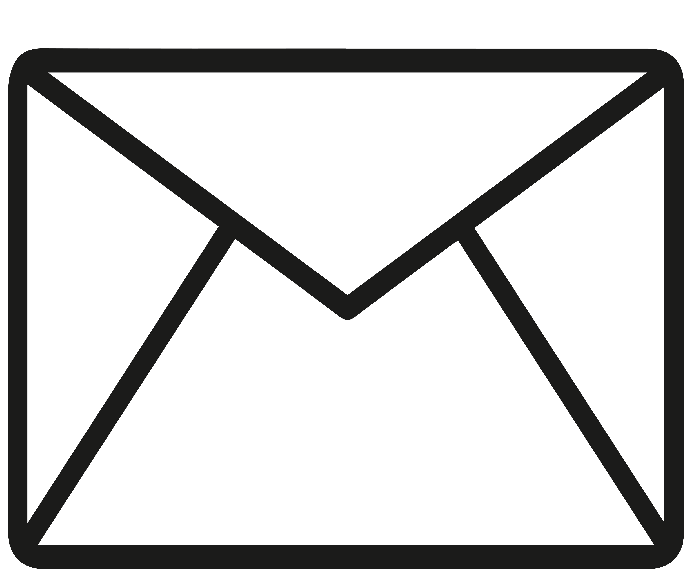

 Hey there! My name is Zia Uddin Muhammad Tarek, and I'm a software engineer with 8 years of experience. My expertise lies in technologies such as Reactjs, Nodejs, Mysql, php, and Javascript. I've got a solid understanding of software development principles and best practices, and I'm confident in my ability to work both independently and as part of a team. Over the years, I've designed, developed, and deployed high-quality software solutions that meet the needs of clients and end-users. I'm passionate about what I do and always strive to deliver exceptional results. If you're looking for someone to join your software development team or project, I believe I would be a valuable asset. Thank You for taking the time to view my GitHub Profile :smile: 

<h2> Now I'm currently </h2>

- 🔭 Working on My Blog, Github Project

- 🌱 Wearning Data Science,AWS,Data Engineering 

- 👯 Looking to collaborate on Projects,Tech Articles 

- 💬 Talk to me about Javascript 

<h2> Skills  </h2>

<h2> Connect with me  </h2>

  
  

<h2> Stuff I worked on last week   </h2>

 

<h2> My GitHub Stats  </h2>

  
  
  
  
  
  

<h2> Some Programming Humor for you </h2>

 
<footer align='center'>README made with help of <a href='https://github.com/rahulbanerjee26/githubProfileReadmeGenerator'>githubProfileReadmeGenerator</a> </footer>
